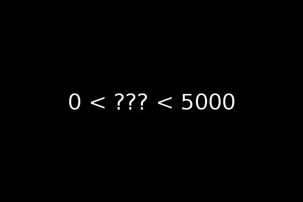

******************************
Writing a Guess My Number Game
******************************
The purpose of this demo is to quickly give you a feel for how the kxg engine 
works by writing a Guess My Number game.  If you're not familiar with this 
game, the idea is that the players will race to guess a number that was picked 
randomly by the computer.  Every time a player makes a guess, the computer will 
tell everyone if it was too high or too low.  Guess My Number makes for a good 
demo because it's simple enough that we won't get lost in the details of 
writing the game itself, but real enough that we'll be able to see the power of 
the game engine.  For example, our implementation will have both multiplayer 
and single-player vs. AI modes.

You can download the `complete demo`_ from the demos folder in the kxg 
repository on GitHub, or you can just follow along with the code snippets on 
this page.

.. _complete demo: https://github.com/kxgames/kxg/blob/master/demos/guess_my_number.py

The game architecture
=====================
In broad strokes, the game engine expects you to implement a handful of classes 
that collectively describe your game.  This includes classes to represent all 
the players themselves (:class:`kxg.Actor`), the actions the players can take 
(:class:`kxg.Message`), the game objects that the players can interact with 
(:class:`kxg.World` and :class:`kxg.Token`).  You then pass these classes to a 
main function function that plays the game. [#]_

Setting up the world
====================
The first class we'll implement is ``World``.  This class is a container for 
every object that is part of the game.  One of the game engine's most 
important responsibilities is to keep the world in sync during multiplayer 
games.  Normally the objects in the world would be mostly tokens (see 
:doc:`/token_overview`), but Guess My Number is a simple game so we only need 
to keep track of four numbers:

* The number to guess.
* The smallest number guessed so far.
* The biggest number guessed so far.
* The id number of the winner, or zero if the game isn't over.

We don't have to do much to implement the world.  All we have to do is inherit 
from :class:`kxg.World` and initialize our four numbers in the constructor::

   import kxg

   class World (kxg.World):
       """
       Keep track of the secret number, the range of numbers that
       haven't been eliminated yet, and the winner (if there is one).
       """

       def __init__(self):
           super().__init__()
           self.number = 0
           self.lower_bound = 0
           self.upper_bound = 0
           self.winner = 0

Note that we don't want to pick a random number to guess here.  The world is 
initialized separately on all the clients, so if we pick a number here every 
client will end up with a different number and the games will be out of sync.  
The game engine uses messages to communicate changes to the world, so in the 
next section we'll use a message to pick a number.

Picking the number
==================
As discussed above, the world can't be initialized with a number to guess.  
Instead the server will pick one and send a message to communicate it to all 
the clients.  This ``PickNumber`` message will also include the upper and lower 
bounds on the number to guess (because the clients need that information as 
well) and methods to check itself and to apply itself to the world::

   import kxg

   class PickNumber (kxg.Message):
       """
       Pick the secret number and communicate that choice to all the
       clients.
       """
   
       def __init__(self, number, lower_bound, upper_bound):
           self.number = number
           self.lower_bound = lower_bound
           self.upper_bound = upper_bound
   
       def on_check(self, world):
           if world.number:
               raise kxg.MessageCheck("number already picked")
   
       def on_execute(self, world):
           world.number = self.number
           world.lower_bound = self.lower_bound
           world.upper_bound = self.upper_bound

The constructor will only used by us and not by the game engine itself, so it 
doesn't need to do anything but store the information that the message will use 
to change the world.  It doesn't even need to call the base class constructor.  
In this case we only need to store the number to guess and the upper and lower 
bounds to show the players.

The ``on_check()`` method is called by the game engine the confirm that the 
message should be allowed given the current state of the world.  If there's a 
problem, ``on_check()`` should raise a :exc:`kxg.MessageCheck` exception.  This 
is important in multiplayer games, because it gives the server veto power over 
messages sent by the clients.  In other words, before a message from one client 
is relayed to all the others, it has to pass the check on the server.  This 
gives the server a way to prevent cheating and to detect when the clients are 
getting out of sync.  For Guess My Number, we just check to make sure that the 
number to guess isn't already set, which would suggest that this message had 
been sent twice somehow.

The ``on_execute()`` method is called by the game engine to let the message 
change the game world.  This message only needs to copy its three attributes 
into the world, so that's what it does.

Guessing the number
===================
We'll use a second message to communicate the guesses that players make.  This 
``GuessNumber`` message will be conceptually very similar to ``PickNumber``.  
The only wrinkle is that we will use :meth:`kxg.World.end_game()` to end the 
game when the right number is guessed::

   import kxg

   class GuessNumber (kxg.Message):
       """
       Make a guess on behalf of the given player.  If the guess is 
       right, that player wins the game.  If the guess is wrong, the 
       range of numbers that the secret number could be is narrowed 
       accordingly.
       """

       def __init__(self, player, guess):
           self.player = player
           self.guess = guess

       def on_check(self, world):
           pass

       def on_execute(self, world):
           if self.guess == world.number:
               world.winner = self.player
               world.end_game()

           elif self.guess < world.number:
               world.lower_bound = max(self.guess, world.lower_bound)

           elif self.guess > world.number:
               world.upper_bound = min(self.guess, world.upper_bound)

The constructor stores a player id number and a guess.  The ``on_execute()`` 
method compares that guess to the secret number.  If the guess is right, the 
message ends the game and sets the player that made the guess as the winner.  
If the guess is wrong, the message narrows the lower and upper bounds that are 
displayed to all the players.

Refereeing the Game
===================
The next class we'll implement is ``Referee``.  The referee runs only on the 
server and sends messages that wouldn't be sent by any of the players.  This 
often boils down to messages that start and end the game.  Our referee will 
only need to concern itself with starting the game, because the ``GuessNumber`` 
message takes care of ending it::

   import kxg
   import random

   LOWER_BOUND, UPPER_BOUND = 0, 5000

   class Referee (kxg.Referee):
       """
       Pick the secret number.
       """

       def on_start_game(self):
           number = random.randint(LOWER_BOUND + 1, UPPER_BOUND - 1)
           self >> PickNumber(number, LOWER_BOUND, UPPER_BOUND)

The lower and upper bounds are global variables just so they can be changed
without having to dig through too much code.  The ``on_start_game()`` method is 
called automatically by the game engine when the game starts.  It picks a 
random number within the given bounds, uses that number to construct a 
``PickNumber`` message, then sends that message using the ``>>`` operator.  We 
can be sure that only one number will be picked because the referee only runs 
on the server and ``on_start_game()`` is only called once.

Making a user interface
=======================
Below is a screenshot of the graphical user interface (GUI) we'll make for 
Guess My Number.  As you can see, it's quite simple.  The numbers on the right 
and left tell the player what numbers have already been guessed.  To make a 
guess, the player just has to type in a number and press Enter.  As the player 
types, their guess will replace the question marks in the middle.

The game engine itself doesn't care how the GUI is written, so for your own 
games you can use whatever graphics library best fits your needs.  We'll use 
pyglet in this tutorial, because it offers a good balance between power and 
ease of use.  If you're not familiar with pyglet, `this brief tutorial`_ covers 
everything we'll need, which really isn't that much more than "Hello world!"

.. _this brief tutorial:
   http://pyglet-current.readthedocs.org/en/latest/programming_guide/quickstart.html

We'll write the GUI in two classes, and the first will be ``Gui``.  The purpose 
of this class will be to store information about the GUI we'll need before, 
during, and after the game itself.  Typically this information will include a 
window handle and maybe some shared menu stuff.  Guess My Number will only use 
``Gui`` to display a post-game "You Won/Lost!" message, but a production game 
would also use it to put together menus and multiplayer lobbies and things like 
that::

   import pyglet

   class Gui:
       """
       Manage GUI objects like the window, which exist before and after the 
       game itself.
       """

       def __init__(self):
           self.width, self.height = 600, 400
           self.window = pyglet.window.Window()
           self.window.set_size(self.width, self.height)
           self.window.set_visible(True)
           self.label = pyglet.text.Label(
                   "",
                   color=(255, 255, 255, 255),
                   font_name='Deja Vu Sans', font_size=32,
                   x=self.width//2, y=self.height//2,
                   anchor_x='center', anchor_y='center',
           )

       def on_refresh_gui(self):
           self.window.clear()
           self.label.draw()

The constructor is where any shared GUI resources should be initialized.  In 
this case, we need to initialize window and label objects.  Hopefully it 
makes sense why the window needs to be used both during and after the game.  
We don't necessarily need to use the same label object during and after the 
game, but doing so makes it easier to set the post-game message and keeps us 
from having to specify the font and positioning of the label twice. [#]_

The ``on_refresh_gui()`` method clears the screen and redraws the label, which 
may have been changed the game since the last redraw.  The game engine calls 
this method automatically before and after the game, and we'll call it manually 
during the game itself.

Our second GUI class will be ``GuiActor``. 

Actors are a core part of the game engine and their role is to represent a 
player in the game.  ``GuiActor`` will represent a human player playing via 

The purpose of this class will be to actually interact with the player during 
the game, so it will render the screenshot from the beginning of this section 
and send messages on behalf of the player.  This will be a long class, but I 
think the best way to work through it will be to show it all at once and to 
break it down method-by-method afterward::

   import kxg

   class GuiActor (kxg.Actor):
       """
       Show the players the range of numbers that haven't been eliminated yet, 
       and allow the player to guess what the number is.
       """

       def on_setup_gui(self):
           self.guess = ''
           self.prompt = "{0.lower_bound} < {1} < {0.upper_bound}"
           self.gui.window.set_handlers(self)

       def on_draw(self):
           self.gui.on_refresh_gui()

       def on_key_press(self, symbol, modifiers):
           # If the user types a number, add that digit to the guess.
           try:
               digit = int(chr(symbol))
               self.guess += str(digit)
           except ValueError:
               pass
           
           # If the user hits backspace, remove the last digit from the guess.
           if symbol == pyglet.window.key.BACKSPACE:
               if self.guess:
                   self.guess = self.guess[:-1]

           # If the user hits enter, guess the current number.
           if symbol == pyglet.window.key.ENTER:
               if self.guess:
                   self >> GuessNumber(self.id, int(self.guess))
                   self.guess = ''

           self.on_update_prompt()

       @kxg.subscribe_to_message(PickNumber)
       @kxg.subscribe_to_message(GuessNumber)
       def on_update_prompt(self, message=None):
           self.gui.label.text = self.prompt.format(
                   self.world, self.guess or '???')

       def on_finish_game(self):
           self.gui.window.pop_handlers()

           if self.world.winner == self.id:
               self.gui.label.text = "You won!"
           else:
               self.gui.label.text = "You lost!"

The constructor simply defines ``self.guess`` and ``self.prompt``.  The former 
will keep track of the numbers the user types and the latter will be formatted 
and displayed to the user each frame.

The ``on_setup_gui()`` method
formatted a

an attribute to keep track of what the user has typed and an attribute to v

The ``on_setup_gui()`` method takes the place of the constructor.  When the 
game starts, the game engine will call this method after storing a reference to 
the ``Gui`` object in ``GuiActor.gui``.  The call to ``set_handlers()`` tells 
pyglet that it should use ``on_draw()`` and ``on_key_press()`` to handle draw 
and keyboard events.  

It tells pyglet to search the given object for event handlers, and for 
``GuiActor`` those are the two handlers it will recognize.

The call to set_handlers() is part of the pyglet API, but it merits some 
explanation.  It tells pyglet 

ais a pyglet feature, but it merits some further explanation.   pyglet to call 
``on_draw()`` and ``on_key_press()`` when the relevant events fire.  configures 

The assignments to ``self.guess`` and ``self.prompt`` 

The ``on_draw`` and ``on_key_press`` methods are

and will then call 
``GuiActor.on_setup_gui()``.  The last line 
of this method instructs pyglet to let ``GuiActor``.  

and The game 
engine It will be 
called automatically by the game engine once the game has started and the actor 
has been given a reference the ``Gui``.
and the game has started.  

Instead of a constructor, ``GuiActor`` has the ``on_setup_gui()`` method.  This 
method is called automatically by the game engine once the game starts

   
The graphical user interface (GUI) will be the longest part of the demo because 
there's just no way to write a GUI from scratch without writing a fair amount 
of code.  

The most complicated part of our game will be the graphical user interface 
(GUI).  To implement the GUI, we will write two classes: ``Gui`` and 
``GuiActor``.  The ``Gui`` class will store information about the GUI that we 
will use both inside and outside the game.  For Guess My Number we will only 
use this information for the game itself and the post-game "You Won/Lost" 
message, but for bigger games you might also use it for menus, multiplayer 
lobbies, and things like that.  The ``GuiActor`` class will represent a player 
in the game.  It will show that player the state of the world and allow that 
player to interact with the game by sending messages.

Making an AI opponent
=====================
Coming soon.

Putting it all together
=======================
Coming soon.

Do as I say, not as I do
========================
Our Guess My Number implementation cuts some corners for the sake of simplicity 
and clarity.  Below is a list of the things that should be done more rigorously 
for full-fledged games:

1. We should've checked that our messages were being sent by the expected 
   players.  For example, only the referee should send ``PickNumber`` messages 
   and only the player making a guess should send ``GuessNumber`` messages 
   (i.e.  players shouldn't be able to make guesses for each other).  This is 
   mostly important to prevent cheating, although it might also help you catch 
   bugs during development.  Here is some code showing what these checks would 
   look like::

      # In PickNumber.on_check()
      if not self.was_sent_by_referee():
          raise kxg.MessageCheck("only the referee can pick the number")

      # In GuessNumber.on_check()
      if not self.was_sent_by(self.player):
          raise kxg.MessageCheck("can't make a guess for another player!")

2. We should've had the referee send an ``EndGame`` message, rather than having 
   the ``GuessNumber`` message end the game on its own if the right number was 
   guessed.  The reason is that whenever a client sends a message, the server 
   might veto it and require it to be undone (see :doc:`/messaging_overview` 
   for more information).  Since ending the game cannot be undone, it's better 
   for that command to come from the server.

3. It's unusual to directly use the actors' id numbers to refer to players.  
   The usual approach is to have each actor create a player token that knows 
   about its id number.
   

.. rubric:: Footnotes

.. [#] For production games, with menus and graphics settings and multiplayer 
   lobbies and all that, you would write your own main function.  But the game 
   engine provides a default main function that's convenient for developing and 
   debugging games.

.. [#] Storing a label in ``Gui`` makes sense for Guess My Number because the 
   GUI is really nothing but a label.  For a more real game, it would make more 
   sense to store a `pyglet.graphics.Batch`_ object instead.

.. _pyglet.graphics.Batch:
   https://pythonhosted.org/pyglet/api/pyglet.graphics-module.html

